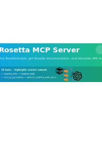

<p align="center">
  
</p>

# Rosetta MCP Server

Author: Ariel J. Ben-Sasson

A Model Context Protocol (MCP) server that lets Cursor (or any MCP client) work with Rosetta, PyRosetta, and Biotite: run RosettaScripts, validate XML protocols, translate between Rosetta and Biotite, score structures, and query documentation -- all from your AI coding assistant.

## What's new in v1.3.0 (vs v1.1.8 on npm)

### New: Biotite integration
- **`rosetta_to_biotite`** -- Find the Biotite equivalent of any Rosetta function with working example code (21 mappings covering structure I/O, SASA, RMSD, superimposition, secondary structure, contacts, hydrogen bonds, B-factors, angles, and more)
- **`biotite_to_rosetta`** -- Reverse lookup: find the Rosetta equivalent of a Biotite function
- **`translate_rosetta_script_to_biotite`** -- Translate entire RosettaScripts XML or PyRosetta code to Biotite Python. Design/optimization operations are flagged as Rosetta-only.
- Fuzzy search with keyword aliases ("contacts", "binding energy", "surface area", "align", etc.)

### Improved: XML to PyRosetta translator
- **37 element types** supported (was 6): 11 movers, 9 filters, 10 selectors, 7 task operations
- **Full attribute handling**: `repeats`, `disable_design`, `cartesian`, `tolerance`, `threshold`, `distance`, and more
- **Child element support**: `MoveMap` (with `Span`), `Reweight`, `ScoreFunction`
- Reports unrecognized elements so you know what needs manual work

### Improved: Help and documentation
- **`get_rosetta_help` now accepts any topic**: movers by name ("FastRelax"), concepts ("constraints", "docking"), or score functions ("ref2015") -- auto-fetches live docs from rosettacommons.org
- **`search_rosetta_web_docs` fallback**: when DuckDuckGo is rate-limited, probes direct Rosetta docs URLs
- **`get_cached_docs` auto-caches**: no need to call `cache_cli_docs` first
- Expanded static help for score_functions, movers, filters, xml, and parameters

### Improved: Scoring
- **`pyrosetta_score`**: new `per_residue` option returns per-residue energy breakdown
- **`scorefxn` parameter** now works (was ignored in v1.1.8)
- Proper error messages for missing files instead of silent `{}`

### Improved: Validation
- **`validate_xml`**: new `validate_against_schema` option checks element names against the Rosetta XSD schema (catches typos like `FastRleax`)

### MCP spec compliance fixes
- `tools/call` responses now use correct `{ content: [{ type: "text", text }] }` format
- Tool errors return `isError: true` (not JSON-RPC errors)
- Standard JSON-RPC error codes (-32601, -32700, -32603)
- Removed false `resources` capability advertisement

### Security fixes
- User input no longer interpolated into Python code (uses env vars / stdin)
- Temp files written to `os.tmpdir()` (not module directory)

### Cleanup
- Removed 3 redundant tools: `list_functions` (merged into `get_rosetta_info`), `search_pyrosetta_wheels`, `cache_cli_docs` (auto-cache in `get_cached_docs`)
- Removed hardcoded personal paths
- Fixed shadowed variables, async anti-patterns, dead code
- **18 tools** (was 21), all with improved agent-oriented descriptions

---

## Example: asking a naive question

This is what makes the MCP server powerful -- an AI agent can answer domain questions by calling the right tools automatically:

**User asks in Cursor:** *"How do I relax my protein and what's the Biotite equivalent?"*

The agent calls two MCP tools behind the scenes:

**1. `get_rosetta_help("FastRelax")` returns 6000+ chars of live documentation:**
> FastRelax performs all-atom relaxation using the FastRelax protocol. Parameters include `scorefxn`, `repeats`, `cartesian`, `disable_design`, `MoveMap` configuration...

**2. `rosetta_to_biotite("FastRelax")` returns:**
```json
{
  "found": true,
  "results": [{
    "rosetta": { "name": "FastRelax", "example": ["relax = FastRelax()", "relax.set_scorefxn(get_score_function('ref2015'))", "relax.apply(pose)"] },
    "biotite": null,
    "equivalence": "none_from_biotite",
    "notes": "Biotite does NOT perform structure optimization. These are Rosetta-specific capabilities."
  }]
}
```

The agent synthesizes: *"FastRelax is Rosetta's all-atom relaxation protocol. Here's how to use it... Note: Biotite is analysis-only and has no equivalent -- you need PyRosetta for structure optimization."*

Without the MCP, the agent would guess from training data and likely get parameter names or API signatures wrong.

---

## What you get (18 tools)

### Discovery & Help
| Tool | Description |
|------|-------------|
| `get_rosetta_info` | All available score functions, movers, filters, selectors, parameters |
| `get_rosetta_help` | Help for any topic -- accepts mover names, concepts, or score functions |
| `pyrosetta_introspect` | Live PyRosetta API search with docs and signatures |

### Documentation
| Tool | Description |
|------|-------------|
| `search_rosetta_web_docs` | Search rosettacommons.org documentation |
| `get_rosetta_web_doc` | Fetch and read a specific docs page |
| `get_cached_docs` | Search cached CLI help (auto-caches on first use) |

### Execution & Scoring
| Tool | Description |
|------|-------------|
| `run_rosetta_scripts` | Run a RosettaScripts XML protocol on a PDB |
| `pyrosetta_score` | Score a PDB with optional per-residue breakdown |

### Translation
| Tool | Description |
|------|-------------|
| `xml_to_pyrosetta` | XML to PyRosetta Python (37 element types) |
| `rosetta_to_biotite` | Find Biotite equivalent of a Rosetta function |
| `biotite_to_rosetta` | Find Rosetta equivalent of a Biotite function |
| `translate_rosetta_script_to_biotite` | Translate full scripts from Rosetta to Biotite |

### Validation & Schema
| Tool | Description |
|------|-------------|
| `validate_xml` | Check XML syntax + optional schema validation |
| `rosetta_scripts_schema` | Generate XSD schema and extract element names |

### Environment
| Tool | Description |
|------|-------------|
| `python_env_info` | Python version and installed packages |
| `check_pyrosetta` | Verify PyRosetta is available |
| `install_pyrosetta_installer` | Auto-install PyRosetta (10-30 min) |
| `find_rosetta_scripts` | Locate the rosetta_scripts binary |

---

## Quick start

### 1. Install from npm
```bash
npm install -g rosetta-mcp-server
```

### 2. Set up Python environment
```bash
# Create a venv with PyRosetta and Biotite
uv venv ~/.venvs/rosetta-mcp
~/.venvs/rosetta-mcp/bin/pip install pyrosetta-installer biotite
~/.venvs/rosetta-mcp/bin/python -c "import pyrosetta_installer as I; I.install_pyrosetta()"
```

Or skip this step -- PyRosetta auto-installs on first use (takes 10-30 min).

### 3. Configure your MCP client

**Cursor** (`~/.cursor/mcp.json`):
```json
{
  "mcpServers": {
    "rosetta": {
      "command": "rosetta-mcp-server",
      "args": [],
      "env": {
        "ROSETTA_BIN": "/path/to/rosetta_scripts.default.macosclangrelease",
        "PYTHON_BIN": "/path/to/.venvs/rosetta-mcp/bin/python"
      }
    }
  }
}
```

**Claude Desktop** (`~/Library/Application Support/Claude/claude_desktop_config.json`):
```json
{
  "mcpServers": {
    "rosetta": {
      "command": "rosetta-mcp-server",
      "env": {
        "ROSETTA_BIN": "/path/to/rosetta_scripts.default.macosclangrelease",
        "PYTHON_BIN": "/path/to/.venvs/rosetta-mcp/bin/python"
      }
    }
  }
}
```

**Environment variables:**
| Variable | Required | Description |
|----------|----------|-------------|
| `ROSETTA_BIN` | No | Path to `rosetta_scripts` binary or its directory. If not set, searches common paths and PATH. |
| `PYTHON_BIN` | No | Python interpreter with PyRosetta/Biotite. Defaults to `python3`. |
| `MCP_DEBUG` | No | Set to `1` for debug logging to stderr. |

### 4. Restart your editor
Open Settings -> MCP. The "rosetta" server should appear green with 18 tools.

---

## XML to PyRosetta translation example

**Input XML:**
```xml
<ROSETTASCRIPTS>
  <SCOREFXNS>
    <ScoreFunction name="ref" weights="ref2015"/>
  </SCOREFXNS>
  <RESIDUE_SELECTORS>
    <Chain name="chainA" chains="A"/>
  </RESIDUE_SELECTORS>
  <MOVERS>
    <FastRelax name="relax" scorefxn="ref" repeats="5" cartesian="true"/>
  </MOVERS>
  <PROTOCOLS>
    <Add mover="relax"/>
  </PROTOCOLS>
</ROSETTASCRIPTS>
```

**Generated PyRosetta code:**
```python
import pyrosetta
from pyrosetta import pose_from_pdb
from pyrosetta.rosetta.core.scoring import get_score_function
from pyrosetta.rosetta.core.select.residue_selector import *
from pyrosetta.rosetta.protocols.relax import *

pyrosetta.init("-mute all")

pose = pose_from_pdb("your_protein.pdb")

# Residue Selectors
chainSelector = ChainSelector()
chainSelector.set_chain_strings("A")

# Movers
fastRelax = FastRelax()
fastRelax.set_scorefxn(get_score_function("ref"))
fastRelax.set_default_repeats(5)
fastRelax.cartesian(True)

sfxn = get_score_function("ref2015")

# Apply movers
fastRelax.apply(pose)

pose.dump_pdb("output.pdb")
score = pose.energies().total_energy()
print(f"Final score: {score}")
```

---

## Rosetta <-> Biotite mapping coverage

| Category | Rosetta | Biotite | Equivalence |
|----------|---------|---------|-------------|
| Structure I/O | `pose_from_pdb` | `PDBFile.read` | Full |
| Structure I/O | `pose.dump_pdb` | `PDBFile.write` | Full |
| Structure I/O | `pose_from_file` (CIF) | `CIFFile.read` | Full |
| Surface Analysis | `SasaMetric` | `biotite.structure.sasa` | Full |
| Alignment | `SuperimposeMover` | `biotite.structure.superimpose` | Full |
| RMSD | `all_atom_rmsd` | `biotite.structure.rmsd` | Full |
| Secondary Structure | `DsspMover` | `annotate_sse` | Partial |
| Sequence | `pose.sequence()` | `get_residues` | Full |
| Distance | `AtomPairConstraint` | `biotite.structure.distance` | Full |
| Angles | `pose.phi/psi/omega` | `biotite.structure.dihedral` | Full |
| Interface | `InterfaceAnalyzerMover` | `sasa` + selection | Partial |
| Database | `rcsb.pose_from_rcsb` | `rcsb.fetch` | Full |
| Selection | `ChainSelector` etc. | numpy boolean indexing | Full |
| Contacts | distance matrices | `CellList` | Partial |
| Ramachandran | `pose.phi/psi` | `dihedral_backbone` | Partial |
| H-bonds | `HBondSet` | `biotite.structure.hbond` | Partial |
| B-factors | `pdb_info().bfactor` | `AtomArray.b_factor` | Full |
| Center of Mass | `center_of_mass` | `mass_center` | Full |
| Scoring | `ScoreFunction` | *None* | Rosetta only |
| Optimization | `FastRelax` | *None* | Rosetta only |
| Design | `FastDesign` | *None* | Rosetta only |

---

## Troubleshooting

- **Server shows red in Cursor**: Restart Cursor. Use absolute path in config (e.g., `/opt/homebrew/bin/rosetta-mcp-server`). Ensure Node 14+ and Python 3.8+.
- **`run_rosetta_scripts` fails**: Verify `ROSETTA_BIN` points to a valid binary. Try `"$ROSETTA_BIN" -help`.
- **PyRosetta tools say "not available"**: Install via `pip install pyrosetta-installer` then run the installer, or let the MCP server auto-install on first use.
- **Biotite tools return no results**: Install Biotite in the same Python env: `pip install biotite`
- **`get_rosetta_help` returns "No detailed help"**: Try the exact Rosetta class name (e.g., "FastRelax" not "relax"). The tool resolves common aliases but may miss unusual names.

## Verify from the command line
```bash
# Check version
echo '{"jsonrpc":"2.0","id":1,"method":"initialize","params":{"protocolVersion":"2024-11-05"}}' | rosetta-mcp-server 2>/dev/null | python3 -c "import sys,json; print(json.loads(sys.stdin.readline())['result']['serverInfo'])"

# List all tools
echo '{"jsonrpc":"2.0","id":1,"method":"tools/list","params":{}}' | rosetta-mcp-server 2>/dev/null | python3 -c "import sys,json; [print(t['name']) for t in json.loads(sys.stdin.readline())['result']['tools']]"
```

## Development
```
rosetta-mcp-server/
├── rosetta_mcp_wrapper.js   # Node MCP server (protocol + all 18 tools)
├── rosetta_mcp_server.py    # Python helper (static Rosetta data)
├── install_pyrosetta.js     # Standalone PyRosetta installer
├── package.json             # npm package config
└── README.md
```

## License and attribution
- MIT for this repository
- Rosetta/PyRosetta: see RosettaCommons licenses; commercial use requires the appropriate license
- Biotite: BSD 3-Clause license
