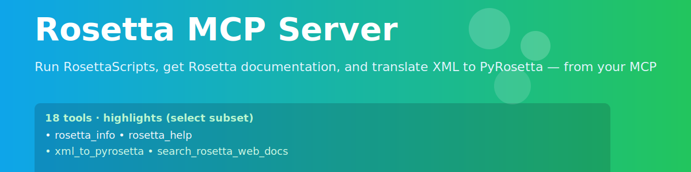

<p align="center">
  
</p>

# Rosetta MCP Server

Author: Ariel J. Ben-Sasson

A Model Context Protocol (MCP) server that lets Cursor (or any MCP client) work with Rosetta and PyRosetta: run RosettaScripts, validate XML protocols, list common movers/filters/selectors, and optionally score/query via PyRosetta.

## What you get
- Run RosettaScripts from Cursor (`run_rosetta_scripts`)
- Generate the RosettaScripts XML schema (`rosetta_scripts_schema`)
- Validate XML (`validate_xml`)
- Browse common movers/filters/selectors and parameters (`list_functions`, `get_rosetta_info`, `get_rosetta_help`)
- Optional PyRosetta tools (`pyrosetta_score`, `pyrosetta_introspect`)
- Environment helpers (`python_env_info`, `check_pyrosetta`, `install_pyrosetta_installer`, `find_rosetta_scripts`, `search_pyrosetta_wheels`)

## Quick start (non‑experts)

1) Install prerequisites (macOS examples)
```bash
brew install node
python3 --version
```

2) Install this server globally
```bash
cd ~/dev/public_repos/rosetta-mcp-server
npm install -g .
```

3) Register the server in Cursor
Edit `~/.cursor/mcp.json` and add/update the `rosetta` entry:
```json
{
  "mcpServers": {
    "rosetta": {
      "command": "/opt/homebrew/bin/rosetta-mcp-server",
      "args": [],
      "env": {
        "ROSETTA_BIN": "/absolute/path/to/rosetta/main/source/bin",
        "PYTHON_BIN": "/Users/<you>/.venvs/rosetta-mcp/bin/python"
      }
    }
  }
}
```
Notes:
- Set ROSETTA_BIN to either the directory containing RosettaScripts executables or the full path to the executable (e.g., `.../rosetta_scripts.default.macosclangrelease` or `.../rosetta_scripts_jd3.default.macosclangrelease`).
- PYTHON_BIN is optional; if set, the server will use that interpreter (recommended when using PyRosetta).

4) Restart Cursor
Open Settings → MCP. The “rosetta” server should be green and its tools visible.

## Setting up the Python environment

Option A (uv virtualenv; recommended):
```bash
uv venv ~/.venvs/rosetta-mcp
~/.venvs/rosetta-mcp/bin/python -m pip install --upgrade pip
```

Install PyRosetta without conda using the official installer:
```bash
~/.venvs/rosetta-mcp/bin/python -m pip install pyrosetta-installer
~/.venvs/rosetta-mcp/bin/python -c "import pyrosetta_installer as I; I.install_pyrosetta()"
```

Verify:
```bash
~/.venvs/rosetta-mcp/bin/python -c "import pyrosetta; pyrosetta.init('-mute all'); print('PyRosetta OK')"
```

Option B (Conda):
```bash
conda create -n rosetta-mcp python=3.9 -y
conda activate rosetta-mcp
conda install -c rosettacommons pyrosetta -y
# Then set PYTHON_BIN in ~/.cursor/mcp.json to this env’s python
```

## Using the tools
- `run_rosetta_scripts`: run RosettaScripts
  - Inputs: `xml_path`, `input_pdb`, `out_dir` (required)
  - Optional: `exe_path` (override), `extra_flags` (array of CLI flags)
  - Executable resolution order: `exe_path` → `ROSETTA_BIN` (file or directory) → common directories → `rosetta_scripts` on PATH
- `rosetta_scripts_schema`: write XSD schema to a cache dir, optional element list
- `validate_xml`: basic syntax validation of an XML string/file
- `get_rosetta_info`, `list_functions`, `get_rosetta_help`: curated info
- `pyrosetta_score` (optional): score a PDB using PyRosetta
- `pyrosetta_introspect` (optional): search PyRosetta classes; return docs/signatures
- Helpers for setup: `python_env_info`, `check_pyrosetta`, `install_pyrosetta_installer`, `find_rosetta_scripts`, `search_pyrosetta_wheels`

## Examples per tool (human‑readable Q&A)

- get_rosetta_info
  - Question: “What Rosetta info does my setup have?”
  - Answer: Returns `rosetta_path`, `pyrosetta_available`, and curated lists (score functions, movers, filters, selectors, task operations, parameters, command‑line options).

- list_functions
  - Question: “Show me common movers/filters/selectors and task operations.”
  - Answer: Returns categorized arrays you can copy into XML (names only).

- get_rosetta_help
  - Question: “Explain ‘filters’ (or ‘movers’, ‘xml’, ‘parameters’, ‘score_functions’).”
  - Answer: Short textual explanation of the topic.

- validate_xml
  - Question: “Is this RosettaScripts XML syntactically valid?”
  - Provide: Your XML string
  - Answer: `{ valid: true }` or `{ valid: false, error: "..." }` with the failing line/column.

- run_rosetta_scripts
  - Question: “Run this protocol on this PDB.”
  - Provide: `xml_path`, `input_pdb`, `out_dir` (and optional flags, e.g., `-nstruct 1`).
  - Answer: `{ exit_code, stdout, stderr, out_dir }`. Results (PDBs, scores) are written under `out_dir` by Rosetta.

- rosetta_scripts_schema
  - Question: “Generate the XML schema and list element names.”
  - Provide: optional `extract_elements: true`.
  - Answer: `{ schema_path, size, elements? }` where `elements` is a deduplicated list of tag names.

- cache_cli_docs
  - Question: “Cache RosettaScripts command‑line help for offline search.”
  - Answer: `{ saved: [help.txt, parser_info.txt] }` paths under a cache directory.

- get_cached_docs
  - Question: “Search the cached docs for ‘parser’ (or any string).”
  - Provide: `query: "parser"` (and optional `max_lines`).
  - Answer: `{ count, matches: [{ file, line, text }, ...] }`.

- pyrosetta_score (requires PyRosetta)
  - Question: “Score this PDB with the default scorefunction.”
  - Provide: `pdb_path`.
  - Answer: `{ score: <number> }`, or `{ error: 'PyRosetta not available: ...' }` if not installed.

- pyrosetta_introspect (requires PyRosetta)
  - Question: “Find ‘FastRelax’ mover (or any mover/filter/selector/task).”
  - Provide: `query: "FastRelax"`, optional `kind: "mover|filter|selector|task"`.
  - Answer: `{ results: [{ name, module, bases, doc, init }, ...], count }`.

## Verify from the command line (optional)
```bash
which rosetta-mcp-server
printf '{"jsonrpc":"2.0","id":1,"method":"initialize","params":{"protocolVersion":"2024-11-05","capabilities":{},"clientInfo":{"name":"check","version":"1"}}}\n' | rosetta-mcp-server
printf '{"jsonrpc":"2.0","id":1,"method":"initialize","params":{"protocolVersion":"2024-11-05","capabilities":{},"clientInfo":{"name":"check","version":"1"}}}\n{"jsonrpc":"2.0","id":2,"method":"tools/list","params":{}}\n' | rosetta-mcp-server
```

## Troubleshooting
- Rosetta server shows red in Cursor
  - Restart Cursor after editing `~/.cursor/mcp.json`.
  - Use an absolute command in config (e.g., `/opt/homebrew/bin/rosetta-mcp-server`).
  - Ensure Node 16+ and Python 3.8+.
  - Check `ROSETTA_BIN` points to a valid directory or executable, or remove it and rely on PATH.
- `run_rosetta_scripts` fails to start
  - Confirm binary is executable (try `"$ROSETTA_BIN" -help`) or pass `exe_path` explicitly.
- PyRosetta tools say “not available”
  - Install PyRosetta using `pyrosetta-installer` (pip) or conda.

## Development
```
rosetta-mcp-server/
├── rosetta_mcp_server.py    # Python server (info/help/xml)
├── rosetta_mcp_wrapper.js   # Node MCP server (stdio protocol + tools)
├── package.json             # NPM package (global binary)
└── README.md                # This file
```

## License and attribution
- MIT for this repository
- Rosetta/PyRosetta: see RosettaCommons licenses; commercial use requires the appropriate license

